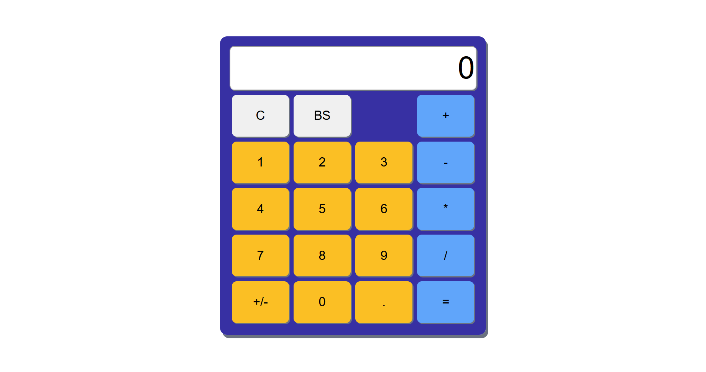
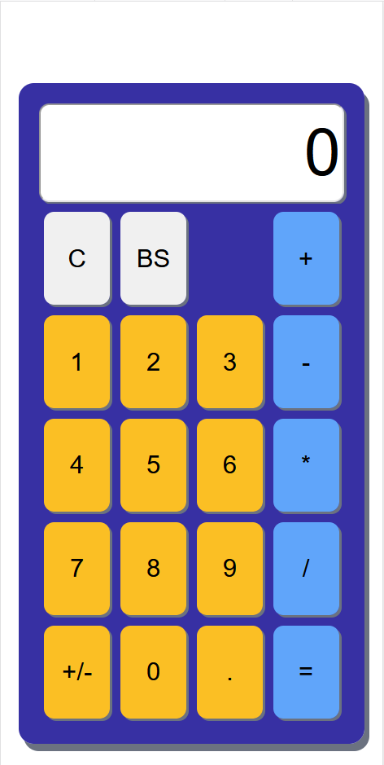

# Calculator - The Odin Project
This repo contains my solution for the [Calculator project](https://www.theodinproject.com/paths/foundations/courses/foundations/lessons/calculator) found in The Odin Project. The goal was to create a simple calculator application for use in a web browser, utilizing only Javascript. The application has been styled to fit most modern screen sizes in order to be accessible to anyone regardless of the device they are viewing the application from.

## Screenshots
Desktop View:

Mobile View:

